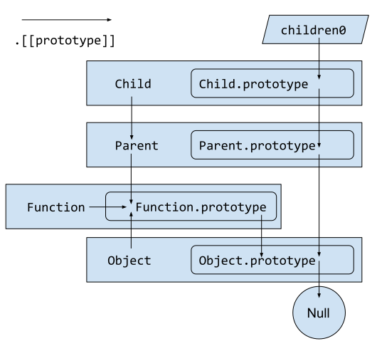
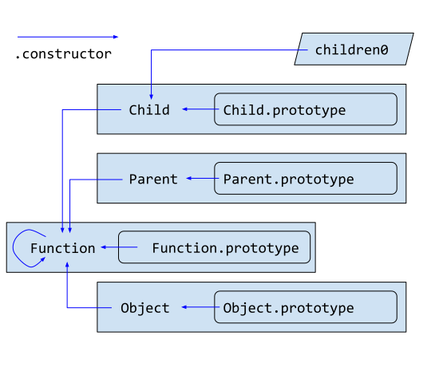

# JavaScript Inheritance: From ECMAScript Specification's Perspective  

## Preface

> Please note that this article emphasizes serious discussions. It may be too boring for beginners, and beginners may learn other interesting and excellent tutorials (such as [class-inheritance](https://javascript.info/class-inheritance)) for better experience :)

We will cover the inheritance of the objects in ECMAScript. First, 
we will discuss the design differences of the objects between >=ES6 and ES5, more specifically, [ECMA-262 13th (ES13 2022)](https://262.ecma-international.org/13.0/) / [ECMA-262 6th (ES6 2015)](https://262.ecma-international.org/6.0/) and [ECMA-262 5.1 (ES5 2011)](https://262.ecma-international.org/5.1/). Then, we will focus on [ECMA-262 13th (ES13 2022)](https://262.ecma-international.org/13.0/). 

// TODO crossRef

There are many code examples in this article. It is highly recommended to paste and try these code examples in the [Chrome DevTools Console](https://developer.chrome.com/docs/devtools/console/javascript/).  

## Notation

Please note that in the following parts, the terms *JavaScript* and *ECMAScript* will be used as needed in specific context, and their meanings are almost the same, see [ECMAScript, ECMA-262 and JavaScript](https://en.wikipedia.org/wiki/ECMAScript#ECMAScript,_ECMA-262_and_JavaScript).  

### Double Square Brackets [[ ]]

[6.1.7.2 Object Internal Methods and Internal Slots](https://262.ecma-international.org/13.0/#sec-object-internal-methods-and-internal-slots)

> Internal methods and internal slots are identified within this specification using names enclosed in double square brackets [[ ]].

## `class` keyword  

### `class` Definition Evaluation

Although we can create classes and objects in the aforementioned low-level way (using functions), we can also use `class` keyword in ES6 to do the same thing. In ES6, `class` keyword is almost syntactic sugar, see [Is `class` just syntactic sugar](https://stackoverflow.com/a/54861781/10973766). However, with the continuous progress of ECMA-262, `class` keyword is not only syntactic sugar in ES13.  

As ECMA-262 13th [15.7.14 Runtime Semantics: ClassDefinitionEvaluation](https://262.ecma-international.org/13.0/#sec-runtime-semantics-classdefinitionevaluation), class elements have public and private *instance fields*, public and private *static fields*, and private *instance methods and accessors*.
These complicated features cannot be carried by functions.
Thus, `class` keyword is recommended as the modern way to create classes.  

For simplicity, we refer to ES6 here.  
In [14.5.14 Runtime Semantics: ClassDefinitionEvaluation](https://262.ecma-international.org/6.0/#sec-runtime-semantics-classdefinitionevaluation) steps,  
- 5\. If *ClassHeritage*_opt is not present, then  
    &nbsp;&nbsp;&nbsp;&nbsp;Let `protoParent` be the intrinsic object %ObjectPrototype%.  
    &nbsp;&nbsp;&nbsp;&nbsp;Let `constructorParent` be the intrinsic object %FunctionPrototype%.
    > Set the `protoParent` and `constructorParent`.
- Let `proto` be `ObjectCreate(protoParent)`.
    > Get the current Class.`prototype` (`proto`) by `protoParent`.
- 8\. If *ClassBody*_opt is not present, let `constructor` be empty.  
  9\. Else, let `constructor` be ConstructorMethod of *ClassBody*.  
  10\. If `constructor` is empty, then,  
  &nbsp;&nbsp;&nbsp;&nbsp;Else,  
    &nbsp;&nbsp;&nbsp;&nbsp;&nbsp;&nbsp;&nbsp;&nbsp;Let `constructor` be the result of parsing the source text  
    &nbsp;&nbsp;&nbsp;&nbsp;&nbsp;&nbsp;&nbsp;&nbsp;`constructor( ){ }`  
    &nbsp;&nbsp;&nbsp;&nbsp;&nbsp;&nbsp;&nbsp;&nbsp;using the syntactic grammar with the goal symbol *MethodDefinition*.  
    12\. Let `constructorInfo` be the result of performing DefineMethod for `constructor` with arguments `proto` and `constructorParent` as the optional `functionPrototype` argument.  
    14\. Let `F` be `constructorInfo`.[[closure]]  
  > Set the `constructor`.
- 16\. Perform `MakeConstructor(F, false, proto)`.  
  17\. Perform `MakeClassConstructor(F)`.  
  18\. Perform `CreateMethodProperty(proto, "constructor", F)`.  
  > Prepare the `constructor` for the current Class. Then, the property "constructor" is added to the class's *prototype*.  
- 24\. Return `F`.  

<br />

## `extends` keyword   

### ES5 Classical Inheritance  

Before we have `extends` in ES6, we use classical inheritance. [MDN Classical inheritance](https://developer.mozilla.org/en-US/docs/Web/JavaScript/Reference/Global_Objects/Object/create#classical_inheritance_with_object.create) shows how to achieve classical inheritance in ES5.  
Note this part,
```js
function Shape() {}

// Rectangle - subclass
function Rectangle() {
  Shape.call(this); // call super constructor (1)
}

// subclass extends superclass (2)
Rectangle.prototype = Object.create(Shape.prototype);

// If we don't set Rectangle.prototype.constructor to Rectangle,
// it will be Shape (the parent).
// To avoid that, we set the prototype.constructor to Rectangle (the child).
// (3)
Rectangle.prototype.constructor = Rectangle;

const rect = new Rectangle();
// prototype chain: rect -> Rectangle.prototype -> Shape.prototype -> Object.prototype -> null
```
1. First, `call` the superclass with specified `this` in the subclass (like `super()`). 
2. Then, the subclass's `prototype` property is pointed to superclass's `prototype` property.  
3. Finally, we set the subclass's `constructor` to the correct constructor (subclass itself).  

Also, you can refer to [Classical inheritance in JavaScript ES5](https://eli.thegreenplace.net/2013/10/22/classical-inheritance-in-javascript-es5).  

### ES6 Inheritance  
In ES6, we have `extends` keyword, and we also have `super()`. Although the inheritance syntax is similar to C++ or Java's syntax, the underlying inheritance implementation is still prototype-based.  

Let's see how `extends` is evaluated in class definition.  
For simplicity, we refer to ES6 here.  
[14.5.14 Runtime Semantics: ClassDefinitionEvaluation](https://262.ecma-international.org/6.0/#sec-runtime-semantics-classdefinitionevaluation)
- 6\. Else  
    &nbsp;&nbsp;&nbsp;&nbsp;b. Let `superclass` be the result of evaluating *ClassHeritage*.  
    &nbsp;&nbsp;&nbsp;&nbsp;g.  
    &nbsp;&nbsp;&nbsp;&nbsp;&nbsp;&nbsp;&nbsp;&nbsp;ii. Let `protoParent` be `Get(superclass, "prototype")`.  
    &nbsp;&nbsp;&nbsp;&nbsp;&nbsp;&nbsp;&nbsp;&nbsp;v. Let `constructorParent` be `superclass`.  
    > If we have `extends` statement,  
    `protoParent <- superclass.prototype` and  
    `constructorParent <- superclass`

- 10\. a.  
    Let `constructor` be the result of parsing the source text  
    `constructor(...args){ super (...args);}`  
using the syntactic grammar with the goal symbol *MethodDefinition*.  
     > If we have `extends` statement,  
     empty `constructor` will include a `super()` by default.  

Let's compare the steps above in ES6 to the steps in ES5 classical inheritance:  
(For ES5 step, see code in [ES5 Classical Inheritance](#es5-classical-inheritance))
||ES6 `extends`|ES5 classical|
|-|-|-|
| |`protoParent <- superclass.prototype`                       |(2)|
| |`constructorParent <- superclass`                           |`Object.assign(Child, Parent)`|
| |`super()`                                                   |(1)|
| |18. Perform `CreateMethodProperty(proto, "constructor", F)`.|(3)|

Note that `constructorParent <- superclass` is for *static member inheritance* and `super()` (see Step 3. of [`super` Keyword Evaluation](#super-keyword-evaluation)), and `Object.setPrototypeOf(Child, Parent)` can implement this.  
For example,
```js
function Shape() {}
Shape.s = 99;

function Rectangle() {
  Shape.call(this);
}
Rectangle.prototype = Object.create(Shape.prototype);
Rectangle.prototype.constructor = Rectangle;

Object.setPrototypeOf(Rectangle, Shape);
// or Object.assign(Rectangle, Shape);

Rectangle.s === 99;
```
In [ES5 Classical Inheritance](#es5-classical-inheritance), inheriting static members is usually implemented by `Object.assign(Child, Parent)`. Although `Object.assign(Child, Parent)` works fine in sharing the static properties, this implement cannot create the correct prototype chain on the Class (don't confuse with the Class.prototype).

Futhermore, you can also refer [__extends in TypeScript](https://stackoverflow.com/a/46458070/10973766) for deeper understanding of `extends`.  

Let's implement a `dummyExtends`.  
This is ported from the polyfill `__extends` in TypeScript.  
```js
// dummyExtends can be implemented like this
function dummyExtends(subC, superC) {
    if (typeof superC !== "function" && superC !== null){
        throw new TypeError();
    }

    // chain: subC -> superC
    Object.setPrototypeOf(subC, superC);

    // chain: subC.prototype -> superC.prototype
    if (superC === null){
        // subC.prototype === the object {}, chain: {} -> null
        subC.prototype = Object.create(superC);
    } else {
        function ctorOfSubCDotPrototype() {
            this.constructor = subC;
        }
        // set subC.prototype's constructor.prototype to superC.prototype
        // so that its instance.[[Prototype]] === superC.prototype
        ctorOfSubCDotPrototype.prototype = superC.prototype;

        // Then, call ctorOfSubCDotPrototype.[[Construct]] to create an object.
        // Recall that [[Construct]] actually return `this`
        // so the object is 
        // {constructor: subC} === subC.prototype, 
        // chain: {constructor: subC} -> superC.prototype
        subC.prototype = new ctorOfSubCDotPrototype();
    }
}

function Parent(name) {
    this.name = name;
    console.log('parent knows');
}

function Child(name, age) {
    Parent.call(this, name);
    this.age = age;
}

dummyExtends(Child, Parent);

const children0 = new Child('a', 1);

children0.constructor === Child;
Object.getPrototypeOf(Child) === Parent;
Object.getPrototypeOf(Child.prototype) === Parent.prototype;
children0 instanceof Parent === true;
children0 instanceof Child === true;
Object.hasOwn(children0, 'name') === true;
Object.hasOwn(children0, 'age') === true;
children0.name === 'a';
children0.age === 1;
```

<br />

## `super` keyword

### Function Call

#### `super()` Evaluation
The syntax `super([arguments])` can invoke a superclass's constructor, and it is valid in class constructors.  

For example,
```js
class Parent {
    constructor(name) {
        this.name = name;
        console.log('parent knows');
    }
}
class Child extends Parent {
    constructor(name, age) {
        // [[Construct]] can be invoked by `super()`
        // so Parent's `constructor` will be executed.  
        super(name);
        this.age = age;
    }
}
const children0 = new Child('a', 1);
// parent knows
```

In [12.3.5.1 Runtime Semantics: Evaluation](https://262.ecma-international.org/6.0/#sec-super-keyword-runtime-semantics-evaluation),

1. Let `newTarget` be `GetNewTarget()`.  
    > `new.target` is the current constructor who is called by `new`.  

3. Let `func` be `GetSuperConstructor()`.  
    > `func` <- currFunc.[[Prototype]]. Note that this is getting currFunc's parent (not currFunc.prototype parent).

5. Let `argList` be ArgumentListEvaluation of `Arguments`.  

7. Let `result` be `Construct(func, argList, newTarget)`.  
    > create an object from the `newTarget.prototype` but call the constructor `func` on the object.

9. Let `thisER` be `GetThisEnvironment()`.  

10. Return `thisER.BindThisValue(result)`.  
    > return `this` which value is the object.

This is similar to `Parent.call(this);` in ES5 classical inheritance. Note that `super([arguments])` actually returns an object from `Construct(func, argList, newTarget)`, which is mandatory, however, it is not mandatory for `Parent.call(this);` to return an object.

<br />

#### Mandatory `super()`

Note that if the constructor is empty, a `super(...args)` is added by default to the default constructor `constructor(...args) {}`, see [ES6 Inheritance](#es6-inheritance). In the constructor function of a subclass, if there is no `super()` call before accessing `this`, a `ReferenceError` will be throwed when `new` invokes the [[Construct]]. However, there is no error when we *define* such a subclass.   

For example,
```js
class Parent {
    constructor(name) {
        this.name = name;
        console.log('parent knows');
    }
}
class Child extends Parent {
    constructor(name, age) {
        //super(name);
        this.age = age;
    }
}
const children0 = new Child('a', 1);
// Uncaught ReferenceError: Must call super constructor in derived class 
// before accessing 'this' or returning from derived constructor
```

Note that for a **base** class, in [9.2.2 [[Construct]] (*argumentsList, newTarget*)](https://262.ecma-international.org/6.0/#sec-ecmascript-function-objects-construct-argumentslist-newtarget),  
- 5\. If *kind* is **"base"**, then  
    &nbsp;&nbsp;&nbsp;&nbsp;a. Let `thisArgument` be `OrdinaryCreateFromConstructor(newTarget, "%ObjectPrototype%")`.  
- 8\. If *kind* is **"base"**, perform `OrdinaryCallBindThis(F, calleeContext, thisArgument)`.

For **base** class, after Step 8. the *envRec*.[[thisBindingStatus]] is NOT **"uninitialized"**. However, the constructor in a subclass has kind **"derived"**, *envRec*.[[thisBindingStatus]] will keep **"uninitialized"**, which causes [8.1.1.3.4 GetThisBinding ()](https://262.ecma-international.org/6.0/#sec-function-environment-records-getthisbinding) throw a `ReferenceError` when accessing `this`. 

Also, note that in Step 10. of [12.3.5.1 Runtime Semantics: Evaluation](https://262.ecma-international.org/6.0/#sec-super-keyword-runtime-semantics-evaluation), we are accessing `this`, which needs a `super()`, so `super()` is mandatory before returning.

The `super()` will set correct *envRec*.[[thisBindingStatus]] in the superclass's constructor. Thus, a `super()` call is mandatory in the [[Construct]] stage instead of in the `ClassDefinitionEvaluation` stage.  

<br />

### Property lookup    

#### `super.` Evaluation   

The syntax `super.propertyOnParent` and `super[expression]` can access properties on an object literal or Class.[[Prototype]], and they are valid in any method definition in both classes and object literals.

By [12.3.5.1 Runtime Semantics: Evaluation](https://262.ecma-international.org/6.0/#sec-super-keyword-runtime-semantics-evaluation) and  
[12.3.5.3 Runtime Semantics: MakeSuperPropertyReference(*propertyKey, strict*)](https://262.ecma-international.org/6.0/#sec-makesuperpropertyreference),  
`super.propertyOnParent` or `super[expression]` actually returns a [Reference Record](https://262.ecma-international.org/13.0/#sec-reference-record-specification-type):  
&nbsp;&nbsp;&nbsp;&nbsp;`SuperReference` {  
    &nbsp;&nbsp;&nbsp;&nbsp;&nbsp;&nbsp;&nbsp;&nbsp;*baseValue* : `envRec.[[HomeObject]].[[GetPrototypeOf]]()`,  
    &nbsp;&nbsp;&nbsp;&nbsp;&nbsp;&nbsp;&nbsp;&nbsp;*referencedName*: `propertyKey`,  
    &nbsp;&nbsp;&nbsp;&nbsp;&nbsp;&nbsp;&nbsp;&nbsp;*strict*: `True`,  
    &nbsp;&nbsp;&nbsp;&nbsp;&nbsp;&nbsp;&nbsp;&nbsp;*thisValue*: `this` in the subclass  
&nbsp;&nbsp;&nbsp;&nbsp;}  
where *strict* represents if the Reference Record originated in [*strict mode code*](https://262.ecma-international.org/13.0/#sec-strict-mode-code).

When we need to get the value of the `SuperReference`, we call [6.2.4.5 GetValue (*V*)](https://262.ecma-international.org/13.0/#sec-getvalue) on the `SuperReference`, which basically returns *baseValue*.*referencedName*.

[Table 27 — Internal Slots of ECMAScript Function Objects [[HomeObject]]](https://262.ecma-international.org/6.0/#sec-ecmascript-function-objects)
> If the function uses `super`, this is the object whose [[GetPrototypeOf]] provides the object where `super` property lookups begin.  

In detail, when getting value from the `SuperReference`, the value named *referencedName* will be lookedup starting from *baseValue* on the prototype chain. That is, we are finding a same-name property on the prototype chain starting from `.[[HomeObject]].[[Prototype]]`.  
Since we would like to keep `this` works as it is in the subclass, we keep a *thisValue* in the `SuperReference`. Then, the superclass's method that uses `this` can behave like it is in the subclass.  

<br />

#### [[HomeObject]]

[[HomeObject]] is a very critical property to make `super` work as we have discussed in [`super.` Evaluation](#super-evaluation-1). However, how to determine its value? Note that 
`super.propertyOnParent` and `super[expression]` are valid in method definition, so we will analyze at the *method* level.  

For an object initializer,  
by [10.2.7 MakeMethod (*F, homeObject*)](https://262.ecma-international.org/13.0/#sec-makemethod) < [15.4.4 Runtime Semantics: DefineMethod](https://262.ecma-international.org/13.0/#sec-runtime-semantics-definemethod) < [13.2.5.5 Runtime Semantics: PropertyDefinitionEvaluation](https://tc39.es/ecma262/multipage/ecmascript-language-expressions.html#sec-runtime-semantics-propertydefinitionevaluation) < [13.2.5.4 Runtime Semantics: Evaluation](https://tc39.es/ecma262/multipage/ecmascript-language-expressions.html#sec-object-initializer),  
1. Let `obj` be `OrdinaryObjectCreate(%Object.prototype%)`.  
2. Perform ? PropertyDefinitionEvaluation of PropertyDefinitionList with argument `obj`.  
3. Return `obj`.  

The `homeObject` of a *method* is the object that the *method* defined in.

For a class,  
by [10.2.7 MakeMethod (*F, homeObject*)](https://262.ecma-international.org/13.0/#sec-makemethod) < [15.4.4 Runtime Semantics: DefineMethod](https://262.ecma-international.org/13.0/#sec-runtime-semantics-definemethod) / [15.4.5 Runtime Semantics: MethodDefinitionEvaluation](https://262.ecma-international.org/13.0/#sec-runtime-semantics-methoddefinitionevaluation) < [15.7.13 Runtime Semantics: ClassElementEvaluation](https://262.ecma-international.org/13.0/#sec-static-semantics-classelementevaluation) < [15.7.14 Runtime Semantics: ClassDefinitionEvaluation](https://262.ecma-international.org/13.0/#sec-runtime-semantics-classdefinitionevaluation),  

- 15\. Else,  
&nbsp;&nbsp;&nbsp;&nbsp;a. Let `constructorInfo` be ! DefineMethod of `constructor` with arguments `proto` and `constructorParent`.  

- 25\. For each ClassElement `e` of `elements`, do  
&nbsp;&nbsp;&nbsp;&nbsp;a. If IsStatic of `e` is **false**, then  
&nbsp;&nbsp;&nbsp;&nbsp;&nbsp;&nbsp;&nbsp;&nbsp;i. Let `element` be Completion(ClassElementEvaluation of `e` with argument `proto`).  
&nbsp;&nbsp;&nbsp;&nbsp;b. Else,  
&nbsp;&nbsp;&nbsp;&nbsp;&nbsp;&nbsp;&nbsp;&nbsp;i. Let `element` be Completion(ClassElementEvaluation of `e` with argument `F`).  

In a class `Foo`,
|            |*constructor*  | *method*      | *static method* |
|-|-|-|-|
|`homeObject`|`Foo.prototype`|`Foo.prototype`|`Foo`            |

Let's see a simple example first,
```js
class Parent {
    // `s` is on Parent
    static s = 'staticCat';
}
class Child extends Parent {
    // `homeObject` is Child
    // baseValue === Parent
    static staticPrint() {
        console.log(super.s);
    }
    // `homeObject` is Child.prototype
    // baseValue === Parent.prototype
    nonstaticPrint(){
        console.log(super.s);
    }
}
Child.staticPrint();
// staticCat

const children0 = new Child();
children0.nonstaticPrint();
// undefined
```
Then, let's see an example with [*class field initialization*](https://github.com/tc39/proposal-class-fields),
```js
class Parent {
    // `s` is on the instance children0 only
    s = 'cat';

    // `print10()` is on Parent.prototype
    print10() { console.log(10); }
}
class Child extends Parent {
    // `homeObject` is Child
    // baseValue === Parent
    static staticPrint() {
        console.log(super.s);
        console.log(super.print10);
    }
    // `homeObject` is Child.prototype
    // baseValue === Parent.prototype
    nonstaticPrint(){
        console.log(super.s);
        console.log(super.print10);
    }
}

// we CANNOT access `s` or `print10`
Child.staticPrint();
// undefined
// undefined

const children0 = new Child();
// we CANNOT access `s`
children0.nonstaticPrint();
// undefined
// ƒ print10(){
//     console.log(10);
//   }
```
Finally, let's see a tricky case,
```js
class Parent {
    // `s` is on the instance children0 only
    s = 'cat';
}
class Child extends Parent {
    // `homeObject` is Child.prototype
    // baseValue === Parent.prototype
    sChild = super.s;
}

const children0 = new Child();
console.log(children0);
// Child {s: 'cat', sChild: undefined}
```
By [15.7.10 Runtime Semantics: ClassFieldDefinitionEvaluation](https://262.ecma-international.org/13.0/#sec-runtime-semantics-classfielddefinitionevaluation),  the part `= 'cat'` is an *Initializer*, and it is wrapped into a function object. Then, we make the function object become a *method*.  
In [15.7.14 Runtime Semantics: ClassDefinitionEvaluation](https://262.ecma-international.org/13.0/#sec-runtime-semantics-classdefinitionevaluation) > [7.3.32 DefineField (*receiver, fieldRecord*)](https://262.ecma-international.org/13.0/#sec-definefield), the function object *initializer* is called and evaluated by [10.2.1.3 Runtime Semantics: EvaluateBody](https://262.ecma-international.org/13.0/#sec-runtime-semantics-evaluatebody), and the *initializer* will return a value to the field name `s`.  

The key is that we actually wrap the *initializer* into a *method* here, which allows us set the value of `[[homeObject]]` properly.


Wait, but why exactly do we need `[[HomeObject]]`?  
If we have no `[[HomeObject]]`, we will naturally use the prototype to find the parent class. However, this is not reliable. Recall that we keep *thisValue* which is `this` value in the subclass. Think about this inheritance,
```js
class Parent {
    constructor(name) {
        this.name = name;
        console.log('parent knows');
    }
    superPrint() {
        console.log('parent print');
    }
}
class Child extends Parent {
    constructor(name, age) {
        super(name);
        this.age = age;
    }
    superPrint() {
        // proposed super.superPrint() implementation
        const protoParent = Object.getPrototypeOf(this);
        protoParent.superPrint.call(this);

        // super.superPrint(); // correct way

        console.log('child print');
    }
}
const children0 = new Child('a', 1);
// parent knows

children0.superPrint();
// Uncaught RangeError: Maximum call stack size exceeded
//    at Function.getPrototypeOf (<anonymous>)
//    at Child.superPrint (<anonymous>:15:28)

// correct way:
// parent print
// child print
```
`Child.superPrint()` uses `this` from last call recursively. `this` always points to `children0`, and `this.[[Prototype]]` always points to `Child.superPrint()`. Thus, the `this` mechanism of `super` actually traps us so we cannot use `this.[[Prototype]]` to find the parent class reliably.  
Therefore, `[[HomeObject]].[[Prototype]]` is necessary for `super` to work.  

<br />

## The Last Mile of *prototype chain*

First, let's build an example,  
```js
class Parent {
    constructor(name) {
        this.name = name;
        console.log('parent knows');
    }
}
class Child extends Parent {
    constructor(name, age) {
        super(name);
        this.age = age;
    }
}
const children0 = new Child('a', 1);
// print: parent knows

children0 instanceof Parent === true;

// Child.[[Prototype]]
Object.getPrototypeOf(Child) === Parent;
// Parent.[[Prototype]]
Object.getPrototypeOf(Parent) === Function.prototype;

// prototype chain: Child -> Parent -> Function.prototype -> ?
```
Note that in [14.5.14 Runtime Semantics: ClassDefinitionEvaluation](https://262.ecma-international.org/6.0/#sec-runtime-semantics-classdefinitionevaluation) steps,  
- 5\. If *ClassHeritage*_opt is not present, then  
    &nbsp;&nbsp;&nbsp;&nbsp;Let `protoParent` be the intrinsic object %ObjectPrototype%.  
    &nbsp;&nbsp;&nbsp;&nbsp;Let `constructorParent` be the intrinsic object %FunctionPrototype%.  

If `Foo` is a class or function, `Foo.prototype.[[Prototype]] === Object.prototype` by default, and `Foo.[[Prototype]] === Function.prototype` by default.  

Wait, what is `Function.prototype.[[Prototype]]`?  
Good question. Now, we need to learn some strange behaviors,   
By [20.2.2 Properties of the Function Constructor](https://262.ecma-international.org/13.0/#sec-properties-of-the-function-constructor) and  
[20.2.3 Properties of the Function Prototype Object](https://262.ecma-international.org/13.0/#sec-properties-of-the-function-prototype-object),  

```js
Function.constructor === Function;

// Be careful here! 
// Function.[[Prototype]] points to itself's constructor.prototype
Object.getPrototypeOf(Function) === Function.prototype;
// Function -> Function.prototype

Function.prototype.constructor === Function;

// Function.prototype is the Function prototype object.
Object.getPrototypeOf(Function.prototype) === Object.prototype;
// Function.prototype -> Object.prototype
```
Also, by [20.1.2 Properties of the Object Constructor](https://262.ecma-international.org/13.0/#sec-properties-of-the-object-constructor) and  
[20.1.3 Properties of the Object Prototype Object](https://262.ecma-international.org/13.0/#sec-properties-of-the-object-prototype-object),  

```js
Object.constructor === Function;

// Be careful here! 
// Object.[[Prototype]] points to Function.prototype
Object.getPrototypeOf(Object) === Function.prototype;
// Object -> Function.prototype

Object.prototype.constructor === Object;

// Object.prototype is the Object Prototype Object
Object.getPrototypeOf(Object.prototype) === null;
// Object.prototype -> null
```

Then, we can build a prototype chain graph:  



When we are accessing `Foo.constructor`, we are actually accessing `Foo.prototype.constructor`. By the prototype chain above, we can build a constructor chain graph:  



```
prototype chain: 

// From a function
Function -> Function.prototype -> Object.prototype -> null
Object -> Function.prototype -> Object.prototype -> null

Child -> Parent -> Function.prototype -> Object.prototype -> null

// From a instance/constructor.prototype
children0 -> Child.prototype -> Parent.prototype -> Object.prototype -> null
```

## Lookup in *prototype chain*   

### Definition of *reference* of a property

In [4.3.1 Objects](https://262.ecma-international.org/13.0/#sec-objects),   
> When a *reference* is made to a property in an object, that *reference* is to the property of that name in the **first object** in the prototype chain that **contains a property of that name**.  

> In other words, first the object mentioned directly is examined for such a property; if that object contains the named property, that is the property to which the reference refers; if that object does not contain the named property, the prototype for that object is examined next; and so on.

By [6.2.4 The Reference Record Specification Type](https://262.ecma-international.org/13.0/#sec-reference-record-specification-type),  
A Reference Record is a resolved name or property binding. It has fields:  
&nbsp;&nbsp;&nbsp;&nbsp;{ `[[Base]]`: ... , `[[ReferencedName]]`: ... , `[[Strict]]`: ... , `[[ThisValue]]`: ... }  

For example,
```js
class Parent {
    constructor(name) {
        this.name = name;
        console.log('parent knows');
    }
}
class Child extends Parent {
    constructor(name, age) {
        super(name);
        this.age = age;
    }
}
const children0 = new Child('a', 1);

'noExist' in children0 === false;
'name' in children0 === true;
'age' in children0 === true;
```
When we are checking if a property exists in `children0` and its prototype chain, we will lookup `children0 -> Child.prototype -> Parent.prototype -> Object.prototype -> null`.   
1. if `children0` has, return True, else
2. if `Child.prototype` has, return True, else
3. if `Parent.prototype` has, return True, else 
4. if `Object.prototype` has, return True, else 
5. return False (no found)

<br />

### Property Accessors

For syntax `MemberExpression[Expression]` or `MemberExpression.IdentifierName`,  
[13.3.2.1 Runtime Semantics: Evaluation](https://262.ecma-international.org/13.0/#sec-property-accessors-runtime-semantics-evaluation) > [13.3.3 EvaluatePropertyAccessWithExpressionKey (*baseValue, expression, strict*)](https://262.ecma-international.org/13.0/#sec-evaluate-property-access-with-expression-key) / [13.3.4 EvaluatePropertyAccessWithIdentifierKey (*baseValue, identifierName, strict*)](https://262.ecma-international.org/13.0/#sec-evaluate-property-access-with-identifier-key) returns a [Reference Record](https://262.ecma-international.org/13.0/#sec-reference-record-specification-type).  

Then, we call [6.2.4.5 GetValue (*V*)](https://262.ecma-international.org/13.0/#sec-getvalue) on the Reference Record *V*, and [6.2.4.5 GetValue (*V*)](https://262.ecma-international.org/13.0/#sec-getvalue) basically returns the value  
&nbsp;&nbsp;&nbsp;&nbsp;`[[Base]].[[Get]] ([[ReferencedName]], GetThisValue(V))`

We will finally get the value in [10.1.8 [[Get]] (*P, Receiver*)](https://262.ecma-international.org/13.0/#sec-ordinary-object-internal-methods-and-internal-slots-get-p-receiver) > [10.1.8.1 OrdinaryGet (*O, P, Receiver*)](https://262.ecma-international.org/13.0/#sec-ordinaryget) steps,  
1. Let `desc` be ? `O.[[GetOwnProperty]](P)`.  
2. If `desc` is undefined, then  
    &nbsp;&nbsp;&nbsp;&nbsp;a\. Let `parent` be ? `O.[[GetPrototypeOf]]()`.  
    &nbsp;&nbsp;&nbsp;&nbsp;b\. If `parent` is **null**, return **undefined**.  
    &nbsp;&nbsp;&nbsp;&nbsp;c\. Return ? `parent.[[Get]](P, Receiver)`.  
3. If `IsDataDescriptor(desc)` is **true**, return `desc.[[Value]]`.  

With the steps, let's implement a `dummyGet`.
```js
// dummyGet can be implemented like this
function dummyGet(p, obj) {
    // Get the property directly present on an object 
    // and not on the object's prototype chain
    const desc = Object.getOwnPropertyDescriptor(obj, p);

    if (desc) {
        return desc.value;
    } else {
        const parentProto =  Object.getPrototypeOf(obj);
        if (parentProto !== null) {
            return dummyGet(p, parentProto);
        }
        return undefined;
    }
}

class Parent {
    constructor(name) {
        this.name = name;
        console.log('parent knows');
    }
}
class Child extends Parent {
    constructor(name, age) {
        super(name);
        this.age = age;
    }
}
const children0 = new Child('a', 1);

dummyGet('noExist', children0) === undefined;
dummyGet('name', children0) === 'a';
dummyGet('age', children0) === 1;
```

<br />


### `in` keyword

`in` operator checks if the specified property is on the object or its prototype chain.  

In [7.3.12 HasProperty (*O, P*)](https://262.ecma-international.org/13.0/#sec-hasproperty) > [10.1.7 [[HasProperty]] (*P*)](https://262.ecma-international.org/13.0/#sec-ordinary-object-internal-methods-and-internal-slots-hasproperty-p) > [10.1.7.1 OrdinaryHasProperty (*O, P*)](https://262.ecma-international.org/13.0/#sec-ordinaryhasproperty),
1. Let `hasOwn` be ? `O.[[GetOwnProperty]](P)`.
2. If `hasOwn` is not **undefined**, return **true**.
3. Let `parent` be ? `O.[[GetPrototypeOf]]()`.
4. If `parent` is not **null**, then  
    &nbsp;&nbsp;&nbsp;&nbsp;a. Return ? `parent.[[HasProperty]](P)`.
    > In fact, `[[HasProperty]]` recursively calls `OrdinaryHasProperty()`
5. Return **false**.

With the steps, let's implement a `dummyIn`.
```js
// dummyIn can be implemented like this
function dummyIn(p, obj) {
    // Get the property directly present on an object 
    // and not on the object's prototype chain
    const hasOwn = Object.getOwnPropertyDescriptor(obj, p);

    if (hasOwn) {
        return true;
    } else {
        const parentProto =  Object.getPrototypeOf(obj);
        if (parentProto !== null) {
            return dummyIn(p, parentProto);
        }
        return false;
    }
}

class Parent {
    constructor(name) {
        this.name = name;
        console.log('parent knows');
    }
}
class Child extends Parent {
    constructor(name, age) {
        super(name);
        this.age = age;
    }
}
const children0 = new Child('a', 1);

dummyIn('noExist', children0) === false;
dummyIn('name', children0) === true;
dummyIn('age', children0) === true;
```


<br />

### `instanceof` keyword
`instanceof` operator checks if the *prototype property of a constructor* appears anywhere in the *prototype chain* of an object.  
In [13.10.2 InstanceofOperator (*V, target*)](https://262.ecma-international.org/13.0/#sec-instanceofoperator) > [20.2.3.6 Function.prototype [@@hasInstance] (*V*)](https://262.ecma-international.org/13.0/#sec-function.prototype-@@hasinstance) > [7.3.22 OrdinaryHasInstance (*C, O*)](https://262.ecma-international.org/13.0/#sec-ordinaryhasinstance) steps,  
- 4\. Let `P` be ? Get(`C`, **"prototype"**).
- 6\. Repeat,  
    &nbsp;&nbsp;&nbsp;&nbsp;a. Set `O` to ? `O.[[GetPrototypeOf]]()`.  
    &nbsp;&nbsp;&nbsp;&nbsp;b. If `O` is **null**, return **false**.  
    &nbsp;&nbsp;&nbsp;&nbsp;c. If` SameValue(P, O)` is **true**, return **true**.  

With the steps, let's implement a `dummyInstanceof`.
```js
// dummyInstanceof can be implemented like this
function dummyInstanceof(obj, ctor) {
    const ctorPrototype = ctor.prototype;
    
    let objProto = Object.getPrototypeOf(obj);
    while (true) {
        if (objProto === null){
            return false;
        }
        if (objProto === ctorPrototype) {
            return true;
        }
        objProto = Object.getPrototypeOf(objProto);
    }
}

class Parent {
    constructor(name) {
        this.name = name;
        console.log('parent knows');
    }
}
class Child extends Parent {
    constructor(name, age) {
        super(name);
        this.age = age;
    }
}
const children0 = new Child('a', 1);

dummyInstanceof(children0, Parent) === true;
dummyInstanceof(children0, Child) === true;
dummyInstanceof(children0, Object) === true;
dummyInstanceof(children0, HTMLElement) === false;
```

<br />

### [[GetOwnProperty]] \(*P*)

#### `getOwnPropertyDescriptor` keyword
[20.1.2.8 Object.getOwnPropertyDescriptor (*O, P*)](https://262.ecma-international.org/13.0/#sec-object.getownpropertydescriptor) > [10.1.5 [[GetOwnProperty]] (*P*)](https://262.ecma-international.org/13.0/#sec-ordinary-object-internal-methods-and-internal-slots-getownproperty-p) is used to get the specified property directly present on an object and not on the object's prototype chain.  

#### `hasOwn` and `hasOwnProperty` keyword
[20.1.3.2 Object.prototype.hasOwnProperty (*V*)](https://262.ecma-international.org/13.0/#sec-object.prototype.hasownproperty) > [10.1.5 [[GetOwnProperty]] (*P*)](https://262.ecma-international.org/13.0/#sec-ordinary-object-internal-methods-and-internal-slots-getownproperty-p) is used to check whether the object has the property directly present on an object and not on the object's prototype chain.  

ECMA-262 13th introduced a new function [20.1.2.13 Object.hasOwn (*O, P*)](https://262.ecma-international.org/13.0/#sec-object.hasown) as a convenient alternative to [20.1.3.2 Object.prototype.hasOwnProperty (*V*)](https://262.ecma-international.org/13.0/#sec-object.prototype.hasownproperty).  

Usually, we call `hasOwnProperty()` on a object, and we are assuming the object has a prototype chain including `Object.prototype`. However, this assuming is not safe all the time.
If
```js
const obj = Object.create(null);
// or
Object.setPrototypeOf(obj, null);
```
we cannot find `hasOwnProperty()` on the prototype chain of the object.  
Before ECMA-262 13th, we can simplely avoid this problem by using 
```js
Object.prototype.hasOwnProperty.call(obj, property)
```
`hasOwn()` is actually syntactic sugar for using `hasOwnProperty()` in a safer way so `hasOwn()` is recommended to be used in the future.  


## Reference
[ECMA-262 13th (ES13 2022)](https://262.ecma-international.org/13.0/)  
[ECMA-262 6th (ES6 2015)](https://262.ecma-international.org/6.0/)  
